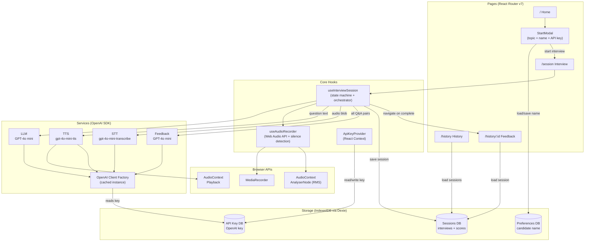
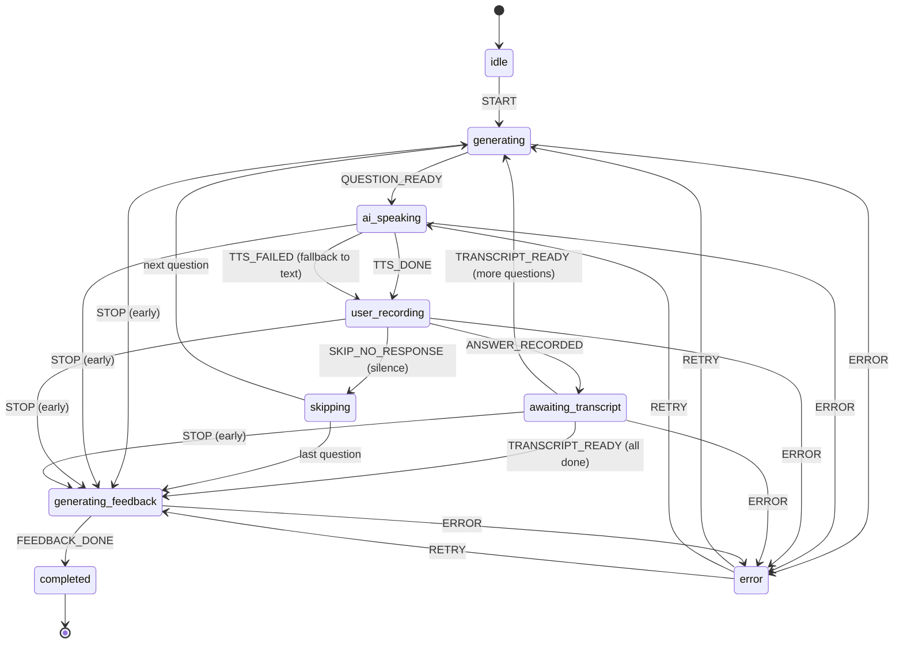

# VoiceRound

AI-powered mock interviewer that helps developers practice technical interviews. The AI asks questions via voice, you answer verbally and you get detailed feedback with ratings.


## Why I Built This

I wanted to get better at explaining technical concepts out loud, the way you have to in real interviews. This app lets me practice that and get honest feedback on both my answers and how I communicate them.

Most mock interview tools I found were paid and I couldn't customize them to focus on what I actually needed to work on. So I made this open source. You can tweak the prompts, add your own topics or change how feedback works. Make it yours.

## Tech Stack

- **Frontend:** Vite 8 + React 19 + TypeScript 5.9
- **Styling:** Tailwind CSS v4 + shadcn/ui
- **AI / Voice:** OpenAI (GPT-4o mini for LLM + STT, gpt-4o-mini-tts for TTS)
- **Storage:** IndexedDB (Dexie.js) — fully local, no backend
- **Testing:** Vitest + React Testing Library + MSW
- **CI:** GitHub Actions (lint + format + unit tests + build)
- **Quality:** Lighthouse CI (performance + accessibility)
- **Pre-commit:** Husky + lint-staged
- **Analytics:** Vercel Analytics

## BYOK (Bring Your Own Key)

This app requires your own OpenAI API key. Your key is stored in IndexedDB on your device and is only sent to OpenAI directly from the browser. No keys are shipped, hardcoded or proxied.

## How It Works

1. Click **Start** → enter your OpenAI API key (first time only), select a topic and question count (5, 7, or 10)
2. Grant microphone access when prompted
3. AI asks questions via text-to-speech
4. You answer verbally — mic records and auto-detects when you stop speaking
5. After all questions, AI generates structured feedback (rating + confidence level + commentary per question + overall summary)
6. Feedback saved to IndexedDB, viewable anytime from History

## Architecture



### Interview Flow (State Machine)



### Data Flow

```text
User clicks Start
    │
    ▼
┌─────────────────────────────────────────────────────────────────┐
│  INTERVIEW LOOP (repeats per question)                          │
│                                                                 │
│  1. LLM generates question (GPT-4o mini + conversation history) │
│  2. TTS speaks question aloud (gpt-4o-mini-tts → AudioContext)  │
│  3. User answers verbally (MediaRecorder + silence detection)   │
│  4. STT transcribes answer (gpt-4o-mini-transcribe)             │
│     └─ waits for transcript before generating next question     │
└─────────────────────────────────────────────────────────────────┘
    │
    ▼
Feedback generation (GPT-4o mini)
    → per-question: rating, confidence, commentary, model answer
    → overall summary
    │
    ▼
Session saved to IndexedDB → navigate to Feedback page
```

## Interview Topics

15 topics across 4 groups:

- **Languages & Runtimes (5):** JavaScript & TypeScript, Python, Go, Java, Rust
- **Frameworks (3):** React & Next.js, Node.js, FastAPI & Django
- **Concepts (6):** System Design (Frontend), System Design (Backend), System Design (Full-Stack), Docker & Kubernetes, AWS & Cloud, GraphQL
- **Behavioral (1):** Behavioral & STAR

## Getting Started

```bash
npm install
npm run dev
```

## Error Handling

- **Invalid API key (401):** prompts user to update key in Settings
- **Quota exhausted (429 — billing):** links to OpenAI billing page
- **Rate limited (429 — rate):** automatic retry with exponential backoff (max 3 attempts)
- **Network failure:** inline error with retry button
- **Request timeout:** per-call timeouts (STT: 60s, LLM: 20s, TTS: 30s, Feedback: 45s)
- **TTS failure:** falls back to displaying question as text

## Audio & Microphone

- Browser compatibility check (MediaRecorder API) before session start
- Mic device detection and permission gating
- Native silence detection via Web Audio API `AnalyserNode` (RMS amplitude) — auto-stops recording after 6 seconds of silence
- Max recording duration: 4 minutes per answer (with 30s warning)
- Transcription runs in the background — next question generates after transcript is ready
- Supported formats: WebM/Opus (Chrome/Firefox), MP4/AAC (Safari)
- All in-flight API calls cancelled via AbortController on navigation/stop

## Accessibility

Accessibility has been a priority from the start. The app is designed to meet WCAG 2.1 AA standards — all interactive elements are fully keyboard-navigable and screen readers are kept informed of recording and session state changes.

## Contributing

Contributions are welcome! Feel free to open an issue or submit a pull request — whether it's a bug fix, a new feature idea, or just a suggestion to improve the experience. All input is appreciated.
