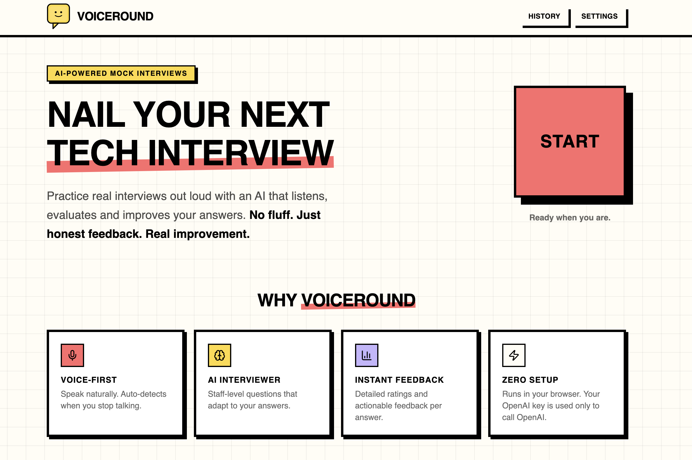
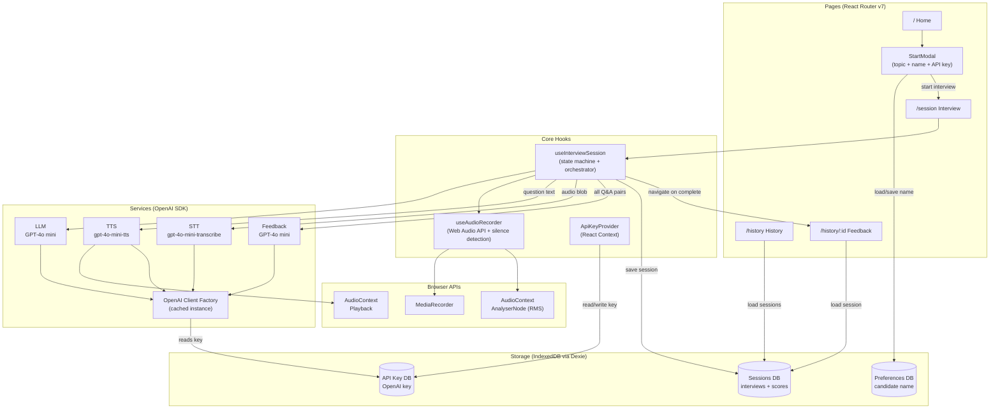
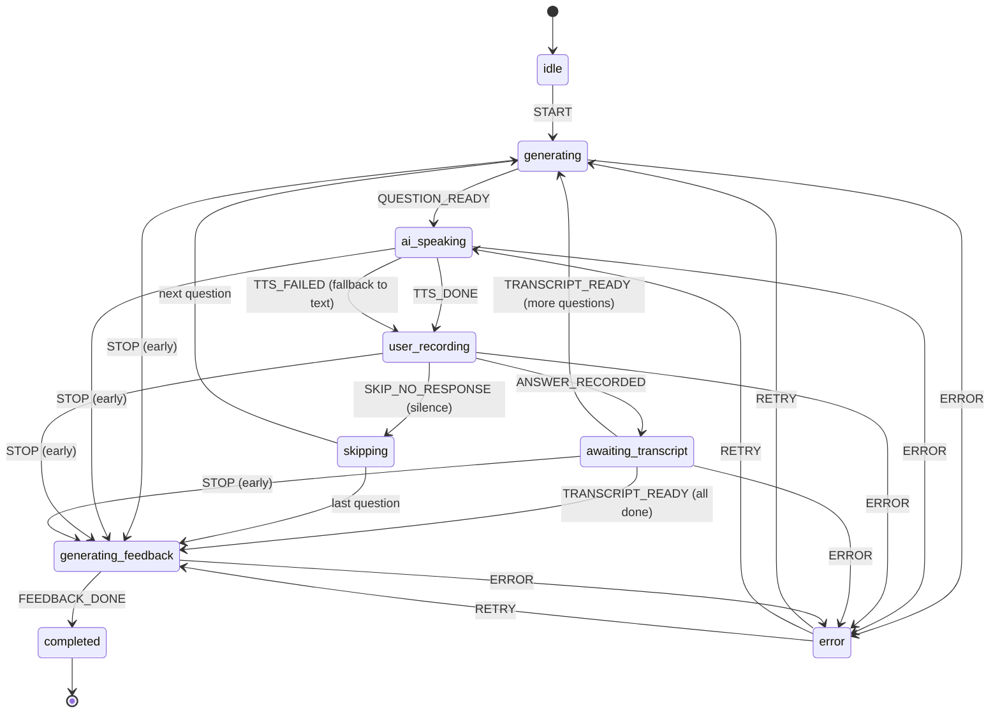

# VoiceRound

AI-powered mock interviewer that helps developers practice technical interviews. The AI asks questions via voice, you answer verbally and you get detailed feedback with ratings.



## Why I Built This

I wanted to get better at explaining technical concepts out loud, the way you have to in real interviews. This app lets me practice that and get honest feedback on both my answers and how I communicate them.

Most mock interview tools I found were paid and I couldn't customize them to focus on what I actually needed to work on. So I made this open source. You can tweak the prompts, add your own topics or change how feedback works. Make it yours.

## Tech Stack

- **Frontend:** Vite 8 + React 19 + TypeScript 5.9
- **Styling:** Tailwind CSS v4 + shadcn/ui
- **AI / Voice:** OpenAI (GPT-4o mini for LLM + STT, gpt-4o-mini-tts for TTS)
- **Storage:** IndexedDB (Dexie.js). Fully local, no backend
- **Desktop (optional):** Tauri v2 shell for macOS and Windows
- **Testing:** Vitest + React Testing Library + MSW
- **CI:** GitHub Actions (lint + format + unit tests + build; tag pushes build the macOS universal `.dmg` and Windows NSIS `.exe` release matrix)
- **Quality:** Lighthouse CI (performance + accessibility)
- **Pre-commit:** Husky + lint-staged
- **Analytics:** Vercel Analytics (web only)

## BYOK (Bring Your Own Key)

This app requires your own OpenAI API key. No keys are shipped or hardcoded. Where the key lives and how it travels depends on the build:

- **Web:** the key is stored in IndexedDB on your device and is sent directly from the browser to OpenAI.
- **Desktop (Tauri):** the key is stored in the system keychain (Keychain on macOS, Credential Manager on Windows). All OpenAI traffic is routed through the bundled Rust proxy so the key never reaches the renderer.

## How It Works

1. Click **Start** → enter your OpenAI API key (first time only), select a topic and question count (5, 7, or 10)
2. Grant microphone access when prompted
3. AI asks questions via text-to-speech
4. You answer verbally — mic records and auto-detects when you stop speaking
5. After all questions, AI generates structured feedback (rating + confidence level + commentary per question + overall summary)
6. Feedback saved to IndexedDB, viewable anytime from History

## Architecture



### Interview Flow (State Machine)



### Data Flow

```text
User clicks Start
    │
    ▼
┌─────────────────────────────────────────────────────────────────┐
│  INTERVIEW LOOP (repeats per question)                          │
│                                                                 │
│  1. LLM generates question (GPT-4o mini + conversation history) │
│  2. TTS speaks question aloud (gpt-4o-mini-tts → AudioContext)  │
│  3. User answers verbally (MediaRecorder + silence detection)   │
│  4. STT transcribes answer (gpt-4o-mini-transcribe)             │
│     └─ waits for transcript before generating next question     │
└─────────────────────────────────────────────────────────────────┘
    │
    ▼
Feedback generation (GPT-4o mini)
    → per-question: rating, confidence, commentary, model answer
    → overall summary
    │
    ▼
Session saved to IndexedDB → navigate to Feedback page
```

## Interview Topics

15 topics across 4 groups:

- **Languages & Runtimes (5):** JavaScript & TypeScript, Python, Go, Java, Rust
- **Frameworks (3):** React & Next.js, Node.js, FastAPI & Django
- **Concepts (6):** System Design (Frontend), System Design (Backend), System Design (Full-Stack), Docker & Kubernetes, AWS & Cloud, GraphQL
- **Behavioral (1):** Behavioral & STAR

## Download

Prebuilt desktop installers for macOS (Apple Silicon + Intel, universal) and Windows (x64) are attached to every tagged release on the [Releases page](https://github.com/rajat-mehra05/voice-round/releases/latest).

Builds are **unsigned**, so the OS shows a one-time warning the first time you launch. This is expected. The bypass below is needed only once per install.

### Installing on macOS

1. Download the `.dmg` from the latest release and open it.
2. Drag VoiceRound into Applications.
3. First launch will say **"VoiceRound cannot be opened because the developer cannot be verified."** Click Cancel.
4. In Finder, **right-click** (or Ctrl-click) the VoiceRound app in Applications and choose **Open**. Click **Open** again in the confirmation dialog. macOS trusts the app from then on.

If right-click → Open doesn't offer the trust option (happens on some newer macOS builds), run this once in Terminal:

```bash
xattr -dr com.apple.quarantine /Applications/VoiceRound.app
```

### Installing on Windows

1. Download the `.exe` from the latest release and run it.
2. Windows SmartScreen shows **"Windows protected your PC."** Click **More info**, then **Run anyway**.
3. The installer downloads the Microsoft WebView2 runtime if it isn't already installed (small, one-time). Follow the prompts.

### Updates and diagnostics

The app checks GitHub Releases on launch and shows a non-blocking toast when a newer version is available. **Settings → Check for updates** runs the same check on demand and surfaces errors (unlike the silent launch check).

Crash traces and stage-duration logs are written via `tauri-plugin-log` to:

- macOS: `~/Library/Logs/com.voiceround.app/voiceround.log`
- Windows: `%LOCALAPPDATA%\com.voiceround.app\logs\voiceround.log`

The file is capped at 1 MB with one-file rotation so the on-disk footprint stays bounded.

Quitting (Cmd+Q, menu quit, or closing the window) during an active recording shows a confirmation dialog so an in-flight answer isn't lost silently.

## Getting Started

```bash
npm install
npm run dev
```

### Desktop (optional)

Running the native desktop shell requires a [Rust toolchain](https://www.rust-lang.org/tools/install) (stable, 1.77+). Once installed:

```bash
npm run tauri:dev     # dev loop, hot reloads the frontend, rebuilds Rust on change
npm run tauri:build   # produces a .dmg (macOS) or NSIS .exe (Windows) in src-tauri/target/release/bundle/
```

First `tauri:build` takes a few minutes while Cargo fetches and builds Tauri's crate graph. Subsequent builds are much faster.

## Build Targets

The project supports two build targets. The active target is selected via `VITE_TARGET`, loaded from `.env` (web, default) and `.env.tauri` (desktop).

| Script                 | Command                             | Output                                                                                   |
| ---------------------- | ----------------------------------- | ---------------------------------------------------------------------------------------- |
| `npm run build`        | alias for `build:web`               | web build                                                                                |
| `npm run build:web`    | `tsc -b && vite build`              | web build                                                                                |
| `npm run build:tauri`  | `tsc -b && vite build --mode tauri` | frontend bundle only, consumed by `tauri:build`                                          |
| `npm run tauri:dev`    | `tauri dev`                         | launches the native desktop app with the dev server                                      |
| `npm run tauri:build`  | `tauri build`                       | produces a packaged `.dmg` (macOS) or NSIS `.exe` (Windows) desktop installer            |
| `npm run sync-version` | `node scripts/sync-version.mjs`     | syncs version across `package.json`, `src-tauri/Cargo.toml`, `src-tauri/tauri.conf.json` |

Tauri configuration is gated behind `mode === 'tauri'` in `vite.config.ts`: relative `base`, modern webview target, and the `TAURI_*` env prefix.

In application code, read the current target via `import.meta.env.VITE_TARGET` or import the selected adapter via `@/platform`. The Rust shell lives in `src-tauri/` and owns OpenAI traffic on desktop: the renderer invokes Tauri commands, Rust pulls the key from the system keychain and runs the HTTP request (including streaming chat + TTS responses) outside the webview. The web build keeps the direct-from-browser path unchanged.

## Error Handling

- **Invalid API key (401):** prompts user to update key in Settings
- **Quota exhausted (429 — billing):** links to OpenAI billing page
- **Rate limited (429 — rate):** automatic retry with exponential backoff (max 3 attempts)
- **Network failure:** inline error with retry button
- **Request timeout:** per-call timeouts (STT: 60s, LLM: 20s, TTS: 30s, Feedback: 45s)
- **TTS failure:** falls back to displaying question as text

## Audio & Microphone

- Browser compatibility check (MediaRecorder API) before session start
- Mic device detection and permission gating
- Native silence detection via Web Audio API `AnalyserNode` (RMS amplitude). Auto-stops recording after 6 seconds of silence
- Max recording duration: 4 minutes per answer (with 30s warning)
- Transcription runs in the background. The next question generates as soon as the transcript is ready
- Supported formats on web: WebM/Opus (Chrome/Firefox), MP4/AAC (Safari)
- On desktop (Tauri): an `AudioWorklet` downsamples 48kHz stereo to 16kHz mono PCM and streams chunks to the Rust proxy during recording so the upload isn't waiting for mic-stop. The worklet is preloaded at app boot so first-record latency matches subsequent recordings
- All in-flight API calls cancelled via `AbortController` on navigation/stop

## Contributing

Contributions are welcome! Feel free to open an issue or submit a pull request — whether it's a bug fix, a new feature idea, or just a suggestion to improve the experience. All input is appreciated.

## License

[MIT](LICENSE)
